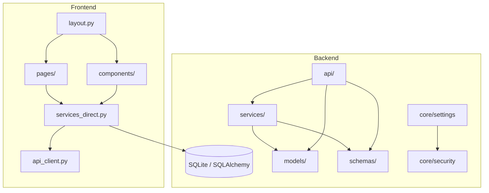

# Project Map

## Key Modules & Responsibilities
* **`backend/app/models/`**: SQLModel / SQLAlchemy entities (learning resources, notes, sessions, paths, reviews, habits).
* **`backend/app/services/`**: Business logic abstractions, including LangChain wrappers (`llm.py`, `embedding.py`), metadata extraction, and local scanning (`scanner.py`).
* **`frontend/app/services_direct.py`**: Performance-optimized direct queries accessing SQL sessions directly inside the NiceGUI process.
* **`frontend/app/components/`**: Interactive widgets (media viewer, folder picker, card arrays, settings drawer).

## Dependency Hotspots
* **SQLAlchemy models & migrations:** Model changes require corresponding revisions in `backend/alembic/`.
* **Path validation:** `backend/app/core/security.py` serves as the checkpoint for upload paths, user home directory access, and sandbox traversal checks.
* **Settings Singleton:** `backend/app/core/settings.py` controls all dynamic behaviors (e.g. AI provider models, database locations).
