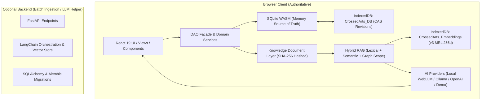
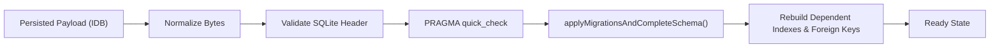

# CrossedArts — Technical Architecture & Hardened System Design

## 1. Core Principles & Non-Negotiable Contracts

CrossedArts is a **local-first, offline-capable learning operating system**.

1. **Client-Side Source of Truth**:
   - SQLite WASM running inside client memory is the single authoritative source of truth for all user entities (courses, books, lessons, flashcards, notes, concepts, knowledge relations, practice work, and learning goals).
   - IndexedDB (`CrossedArts_DB`) holds the binary serialized copy of the SQLite database.
   - Concurrency uses Compare-And-Swap (CAS) based on monotonic coordinator revisions (`saveToStorageWithCas`) across tabs.
2. **Deterministic Lifecycle & Storage Safety**:
   - Snapshot loading -> Byte normalization -> SQLite header validation -> SQLite integrity check (`PRAGMA quick_check`) -> Ordered legacy migrations (`applyMigrationsAndCompleteSchema`) -> Schema completion -> Dependent indexes -> Ready.
   - Unknown/unsupported snapshot payloads never resolve to empty databases; errors are raised explicitly to prevent accidental data erasure.
   - User-authored data is sacred: derived caches (embeddings, vector indexes) can be invalidated and re-indexed deterministically, while user entities are never destroyed.
3. **Canonical Knowledge Document Model**:
   - Unified `KnowledgeDocument` abstraction (`frontend/src/ai/knowledge/types.ts`) represents domain entities (resources, lessons, notes, flashcards, practice work, graph concepts) with content-addressed SHA-256 signatures.
   - Adapters (`frontend/src/ai/knowledge/adapters.ts`) convert SQLite domain entities into canonical documents for semantic chunking and indexation.
4. **Hybrid RAG & Honest Provenance**:
   - Multi-tier retrieval combining BM25-like lexical scoring with on-device Matryoshka embeddings (`embeddinggemma-300m-ONNX`, 256d).
   - Graph scope resolution expands hard boundaries (1-hop connected nodes) without arbitrary global leakage.
   - Deterministic Reciprocal Rank Fusion (RRF) and source diversification (max 2 chunks per entity).
   - Every generated answer includes structured citations (`RagSourceCitation`) and honest model identification (`modelUsed`).
5. **Modular AI Strategy & Model Runtime**:
   - AI provider strategies (`frontend/src/ai/providers/`): Local on-device (WebLLM / WebGPU / WASM fallback), Ollama (local server), OpenAI (in-memory opt-in key), and Demo (zero-network offline heuristic).
   - Task selector (`frontend/src/lib/localLlm/taskSelector.ts`) pairs workloads (tutor, summarization, flashcards, questions) with right-sized models based on hardware capabilities.
6. **Zero-Web-Access Static Deployment**:
   - Static SPA (React 19 + TypeScript + Vite) deployed to GitHub Pages (`main -> GitHub Actions -> GitHub Pages`).
   - SQLite WASM (`sql-wasm.wasm`) is shipped locally in `frontend/public/`—zero external CDN script dependencies.
   - Optional Python FastAPI backend for offline batch processing and heavy metadata extraction.

---

## 2. Subsystem Architecture

---

## 3. Database Migration & Integrity Pipeline

### Migration Invariants:
- All legacy schema columns are added **before** composite indexes referencing them are constructed.
- Table rebuilds preserve row counts, check constraints, and foreign key integrity.
- Failed migrations never overwrite the persisted IndexedDB snapshot.

---

## 4. RAG Retrieval & Citation Pipeline

1. **Scope Resolution**: Extracts anchor resource/lesson and 1-hop graph neighbors via `dao.getRelatedNodeIds`.
2. **Parallel Candidate Gathering**:
   - Lexical matching across courses, modules, lessons, notes, flashcards, graph concepts, and practice work.
   - Semantic retrieval using on-device embedding cache (Matryoshka 256d vectors).
3. **Staleness Filtering**: Compares candidate `contentHash` with current SQLite entity hash. Stale vectors are dropped immediately.
4. **Scoring & Fusion**: Combines lexical score and semantic similarity using RRF (`computeRrfScore`) and applies deterministic `SCOPE_BOOST` (0.15) to in-scope items.
5. **Diversification & Slicing**: Caps chunks per source to 2, ensuring varied context.
6. **Provenance Attribution**: Generates structured citations with navigable breadcrumb paths (`[Course, Module, Lesson]`).
